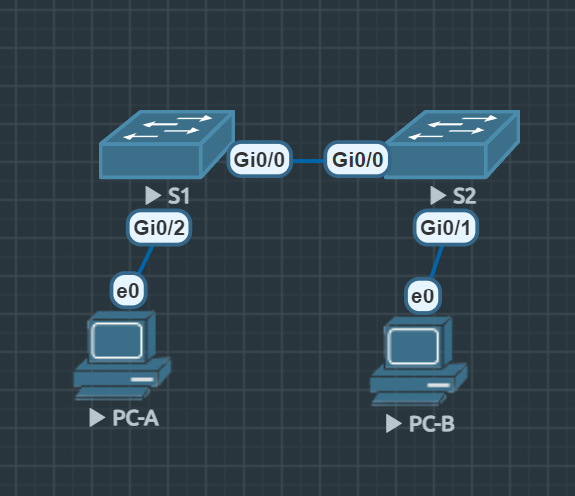
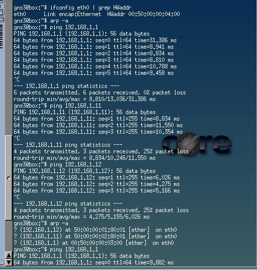

# Лабораторная работа. Просмотр таблицы MAC-адресов коммутатора

## Топология


## Таблица адресации

| Устройство | Интерфейс | IP-адрес | Маска подсети |
|------------|-----------|----------|---------------|
| S1 | VLAN 1 | 192.168.1.11 | 255.255.255.0 |
| S2 | VLAN 1 | 192.168.1.12 | 255.255.255.0 |
| PC-A | NIC | 192.168.1.1 | 255.255.255.0 |
| PC-B | NIC | 192.168.1.2 | 255.255.255.0 |

## Цели

* Часть 1. [Создание и настройка сети](#создание-и-настройка-сети)
* Часть 2. [Изучение таблицы МАС-адресов коммутатора](#изучение-таблицы-мас-адресов-коммутатора)


## Создание и настройка сети
Для настройки каждого коммутатора был написан общий скрипт, с заменой ip и портов на те, что фактически будут использованы. Для оптимизации cpu было принято решение отключить все, что не будет использоваться в рамках поставленной задачи.
```bash
enable
configure terminal
hostname S1
no ip cef
no ip routing
no service dhcp
no cdp run
no lldp run
no ip domain-lookup
interface vlan 1
ip address 192.168.1.11 255.255.255.0
no shutdown
exit
line console 0
password cisco
login
exit
line vty 0 4
password cisco
login
exit
enable secret class
exit
interface range gigabitEthernet 0/2-3
shutdown
exit
interface range gigabitEthernet 1/0-3
shutdown
exit
copy running-config startup-config
reload
```

Для настройки PC использовалась эта команда с заменой ip на необходимый для выбранного узла.
```bash
sudo ifconfig eth0 192.168.1.2 netmask 255.255.255.0 up
```

## Изучение таблицы МАС-адресов коммутатора

### Запишите мак адреса сетевых устройств:

**PC-A mac**:
```bash
ifconfig eth0 | grep HWaddr
eth0    Link encap:Ethernet HWaddr  00:50:00:00:03:00
```
**PC-B mac**:
```bash
ifconfig eth0 | grep HWaddr
eth0    Link encap:Ethernet HWaddr  00:50:00:00:04:00
```
**S1mac**:
```bash
S1#show interface Gi0/0 | include bia
  Hardware is iGbE, address is 5000.0002.0000 (bia 5000.0002.0000)

```
**S2 mac**:
```bash
S2#show interface Gi0/0 | include bia
  Hardware is iGbE, address is 5000.0001.0000 (bia 5000.0001.0000)
```

### Просмотр таблицы мас-адресов коммутатора
Таблица мас-адресов S2:
```bash
S2#show mac address-table
          Mac Address Table
-------------------------------------------

Vlan    Mac Address       Type        Ports
----    -----------       --------    -----
   1    0050.0000.0300    DYNAMIC     Gi0/0
   1    0050.0000.0400    DYNAMIC     Gi0/1
   1    5000.0002.0000    DYNAMIC     Gi0/0
Total Mac Addresses for this criterion: 3

```
- *Если вы не записали МАС-адреса сетевых устройств в шаге 1, как можно определить, каким устройствам принадлежат МАС-адреса, используя только выходные данные команды show mac address-table? Работает ли это решение в любой ситуации?*

Можно попробовать сделать вывод по первым трем октетам, однако это не гарантия, так как mac можно клонировать, вируальные интерфейсы могут использовать свои OUI, проиводители могут меняться и т.п.

После очистки таблицы командой clear mac address-table dynamic таблица MAC-адресов стала пустой. В ней не было адресов ни для VLAN 1, ни для PC-A/B. Спустя 10 сек. таблица заполнилась снова благодаря служебному трафику.

#### *Блок ответов на вопросы*

##### 1. Не считая адресов многоадресной и широковещательной рассылки, сколько пар IP- и МАС-адресов устройств было получено через протокол ARP?

**Ответ:** Активного трафика не было. Вывод `arp -a` был пуст.

##### 2. От всех ли устройств получены ответы?

**Ответ:** Да, ответы были получены от всех устройств: PC-A, S1 и S2.


##### 3. Добавил ли коммутатор в таблицу МАС-адресов дополнительные МАС-адреса? Если да, то какие адреса и устройства?

**Ответ:** Да, коммутатор S2 добавил в таблицу mac-адресов новые записи. Появилась новая запись, однако она не соответствует ни одному мас-адресу физического интерфейса. Так как пинг идет через ip, запрос был направлен с физ. порта на виртуальный и его мас уже соответсвует новой записи в таблице.
```bash
Vlan    Mac Address       Type        Ports
----    -----------       --------    -----
   1    0050.0000.0300    DYNAMIC     Gi0/0
   1    0050.0000.0400    DYNAMIC     Gi0/1
   1    5000.0002.0000    DYNAMIC     Gi0/0
   1    5000.0002.8001    DYNAMIC     Gi0/0
Total Mac Addresses for this criterion: 4

```

```bash
S1#show interface vlan1 | include bia
  Hardware is Ethernet SVI, address is 5000.0002.8001 (bia 5000.0002.8001)

```

