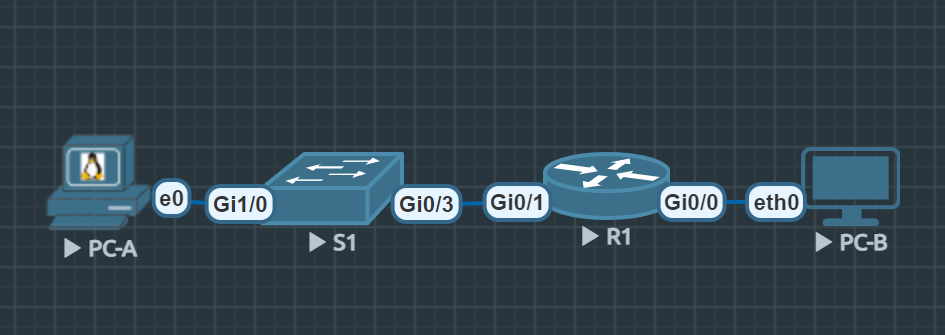

# Лабораторная работа. Настройка IPv6-адресов на сетевых устройствах

## Топология


## Таблица адресации
| Устройство | Интерфейс | IPv6-адрес | Link local IPv6-адрес | Длина префикса | Шлюз по умолчанию |
| :--- | :--- | :--- | :--- | :--- | :--- |
| **R1** | G0/0/0 | `2001:db8:acad:a::1` | `fe80::1` | 64 | — |
| **R1** | G0/0/1 | `2001:db8:acad:1::1` | `fe80::1` | 64 | — |
| **S1** | VLAN 1 | `2001:db8:acad:1::b` | `fe80::b` | 64 | — |
| **PC-A** | NIC | `2001:db8:acad:1::3` | SLAAC | 64 | `fe80::1` |
| **PC-B** | NIC | `2001:db8:acad:a::3` | SLAAC | 64 | `fe80::1` |

### Задачи:
* Часть 1. [Настройка топологии и конфигурация основных параметров маршрутизатора и коммутатора](#настройка-топологии-и-конфигурация-основных-параметров-маршрутизатора-и-коммутатора)
* Часть 2. [Ручная настройка IPv6-адресов](#ручная-настройка-ipv6-адресов)
* Часть 3. [Проверка сквозного подключения](#часть-3-проверка-сквозного-подключения)

## Настройка топологии и конфигурация основных параметров маршрутизатора и коммутатора
В ходе выполнения первой части работы были выполнены следующие действия:

##### На маршрутизаторе R1:

- Задано имя хоста `R1`.
- Настроены привилегированный пароль (`enable secret`) и пароль для доступа к консоли (`line console 0`).
- Включена IPv6-маршрутизация командой `ipv6 unicast-routing`, чтобы маршрутизатор мог отправлять RA сообщения и обеспечивать автоматическую настройку адресов для подключённых устройств.
- Отключены неиспользуемые протоколы и сервисы для снижения нагрузки на CPU.
- Отключены неиспользуемые интерфейсы.

##### На коммутаторе S1:

- Задано имя хоста `S1`.
- Настроен пароль для доступа к консоли.
- Включена IPv6-маршрутизация (`ipv6 unicast-routing`) для поддержки IPv6 на виртуальном интерфейсе управления VLAN 1.
- Отключены неиспользуемые протоколы для снижения нагрузки.
- Отключены неиспользуемые порты для снижения потребления ресурсов.

## Ручная настройка IPv6-адресов
**Активируйте IPv6-маршрутизацию на R1**
*Шаг был сделан заранее при первичной настройке роутера*
```bash
R1#show ipv6 interface brief
GigabitEthernet0/0     [up/up]
    FE80::1
    2001:DB8:ACAD:A::1
GigabitEthernet0/1     [up/up]
    FE80::1
    2001:DB8:ACAD:1::1
GigabitEthernet0/2     [administratively down/down]
    unassigned
GigabitEthernet0/3     [administratively down/down]
    unassigned
```
**Назначьте IPv6-адреса интерфейсу управления (SVI) на S1**
*Шаг так же был выполнен во время первичной настройки.*

```bash
S1#show ipv6 interface vlan1
Vlan1 is up, line protocol is up
  IPv6 is enabled, link-local address is FE80::B
  No Virtual link-local address(es):
  Global unicast address(es):
    2001:DB8:ACAD:1::B, subnet is 2001:DB8:ACAD:1::/64
  Joined group address(es):
    FF02::1
    FF02::2
    FF02::1:FF00:B
  MTU is 1500 bytes

```
**Назначьте компьютерам статические IPv6-адреса.
PC-A**
*пример адреса до переназначения статического ip.*
```bash
VPCS> ip a
GLOBAL SCOPE      : 2001:db8:acad:a:2050:79ff:fe66:6802/64
ROUTER LINK-LAYER : 50:00:00:04:00:00
```
*после смены:*
PC-A
```bash
VPCS> ip 2001:db8:acad:1::3/64 fe80::1
PC1 : 2001:db8:acad:1::3/64

VPCS> ip a
GLOBAL SCOPE      : 2001:db8:acad:1::3/64
ROUTER LINK-LAYER : 50:00:00:03:80:01
```

PC-B
```bash
VPCS> ip 2001:db8:acad:a::3/64 fe80::1
PC1 : 2001:db8:acad:a::3/64

VPCS> ip a
GLOBAL SCOPE      : 2001:db8:acad:a::3/64
ROUTER LINK-LAYER : 50:00:00:04:00:00
```

## Проверка сквозного подключения
*Примечание. VPCS не поддерживает отправку эхо-запросов на локальный адрес. Нет zone id, явное указание интерфейса тоже не работает. PC-A превратился в урезанный линукс на базе tinycore*
**С PC-A отправьте эхо-запрос на FE80::1. Это локальный адрес канала, назначенный G0/1 на R1.**

**Отправьте эхо-запрос на интерфейс управления S1 с PC-A.**
```bash
S1>ping 2001:db8:acad:1::3
Type escape sequence to abort.
Sending 5, 100-byte ICMP Echos to 2001:DB8:ACAD:1::3, timeout is 2 seconds:
!!!!!
Success rate is 100 percent (5/5), round-trip min/avg/max = 1/5/19 ms
```
**Введите команду tracert на PC-A, чтобы проверить наличие сквозного подключения к PC-B**
```bash
VPCS> trace 2001:db8:acad:1::3

trace to 2001:db8:acad:1::3, 64 hops max
 1 2001:db8:acad:a::1   12.046 ms  4.166 ms  2.305 ms
 2 2001:db8:acad:1::3   35.496 ms  9.954 ms  11.749 ms

#На tinycore нет встроенной tracert в любом виде T_T. Пошла от обратного.
```
**С PC-B отправьте эхо-запрос на PC-A.**
```bash
VPCS> ping 2001:db8:acad:1::3

2001:db8:acad:1::3 icmp6_seq=1 ttl=63 time=17.462 ms
2001:db8:acad:1::3 icmp6_seq=2 ttl=63 time=9.585 ms
2001:db8:acad:1::3 icmp6_seq=3 ttl=63 time=9.232 ms
2001:db8:acad:1::3 icmp6_seq=4 ttl=63 time=11.169 ms
```
**С PC-B отправьте эхо-запрос на локальный адрес канала G0/0 на R1.**
```bash
VPCS> ping 2001:db8:acad:a::1

2001:db8:acad:a::1 icmp6_seq=1 ttl=64 time=3.818 ms
2001:db8:acad:a::1 icmp6_seq=2 ttl=64 time=2.916 ms
2001:db8:acad:a::1 icmp6_seq=3 ttl=64 time=3.024 ms
2001:db8:acad:a::1 icmp6_seq=4 ttl=64 time=3.863 ms
```

#### Вопросы для повторения
- Часть 1. Почему обоим интерфейсам Ethernet на R1 можно назначить один и тот же локальный адрес канала — FE80::1? 
Ответ: *Они в разных широковещательных доменах*
- Часть 2. Какой идентификатор подсети в индивидуальном IPv6-адресе 2001:db8:acad::aaaa:1234/64?
Ответ: *При длине префикса /64 идентификатор подсети занимает первые 64 бита адреса. Идентификатор подсети - 2001:db8:acad::/64*