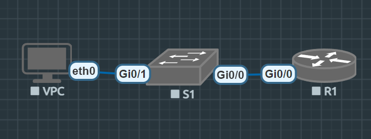

# Лабораторная работа. Доступ к сетевым устройствам по протоколу SSH

## Топология


## Таблица адресации
| Устройство | Интерфейс | IP-адрес | Маска подсети | Шлюз по умолчанию |
|------------|-----------|----------|---------------|-------------------|
| R1         | Gi0/0    | 192.168.1.1 | 255.255.255.0 | — |
| S1         | VLAN 1    | 192.168.1.11 | 255.255.255.0 | 192.168.1.1 |
| PC-A       | NIC       | 192.168.1.3 | 255.255.255.0 | 192.168.1.1 |

## Задачи:
* Часть 1. [Настройка основных параметров устройства](#настройка-основных-параметров-устройства)
* Часть 2. [Настройка маршрутизатора для доступа по протоколу SSH](#настройка-маршрутизатора-для-доступа-по-протоколу-ssh)
* Часть 3. [Настройка коммутатора для доступа по протоколу SSH](#настройка-коммутатора-для-доступа-по-протоколу-ssh)
* Часть 4. [SSH через интерфейс командной строки (CLI) коммутатора](#ssh-через-интерфейс-командной-строки-cli-коммутатора)

## Настройка основных параметров устройства
В ходе выполнения первой части работы были выполнены следующие действия:

##### На коммутаторе S1:

Для настроек были введены следующие команды:
```bash
enable
configure terminal
no ip domain-lookup
hostname S1
enable secret class
line console 0
password cisco
login
exit
line vty 0 4
password cisco
login
exit
service password-encryption
banner motd #Unauthorized access prohibited#
interface vlan 1
ip address 192.168.1.11 255.255.255.0
no sh
exit
end
copy run start
```

##### На коммутаторе R1:

```bash
enable
configure terminal
no ip domain-lookup
enable secret class
line console 0
password cisco
login
exit
line vty 0 4
password cisco
login
exit
service password-encryption
banner motd #Authorized access only!#
interface Gi0/0
ip address 192.168.1.1 255.255.255.0
no sh
exit
end
copy run start
```
PC-A:
```bash
VPCS> ip 192.168.1.3/24 192.168.1.1
Checking for duplicate address...
VPCS : 192.168.1.3 255.255.255.0 gateway 192.168.1.1

VPCS>
VPCS> ping 192.168.1.1

84 bytes from 192.168.1.1 icmp_seq=1 ttl=255 time=8.161 ms
84 bytes from 192.168.1.1 icmp_seq=2 ttl=255 time=5.270 ms
84 bytes from 192.168.1.1 icmp_seq=3 ttl=255 time=6.080 ms
84 bytes from 192.168.1.1 icmp_seq=4 ttl=255 time=5.997 ms
^C

```
## Настройка маршрутизатора для доступа по протоколу SSH

```bash
R1(config)#ip domain-name r1-lab.local
R1(config)#crypto key generate rsa general-keys modulus 1024
R1(config)#ip ssh version 2
R1(config)#username admin secret Adm1n@55
R1(config)#line vty 0 4
R1(config-line)#login local
R1(config-line)#transport input ssh
R1(config-line)#do copy run start
```

## Настройка коммутатора для доступа по протоколу SSH

```bash
S1(config)#ip domain-name s1-lab.local
R1(config)#crypto key generate rsa general-keys modulus 1024
S1(config)#ip ssh version 2
S1(config)#username admin secret Adm1n@55
S1(config)#line vty 0 4
S1(config-line)#login local
S1(config-line)#transport input ssh
S1(config-line)#do copy run start
```

## SSH через интерфейс командной строки (CLI) коммутатора

```bash
S1#ssh -l admin 192.168.1.1
Password:
Unauthorized access prohibited
R1>
S1#   #здесь я пробую переключиться обратно на коммутатор
[Resuming connection 1 to 192.168.1.1 ... ]

R1>exit

[Connection to 192.168.1.1 closed by foreign host]
S1#

```