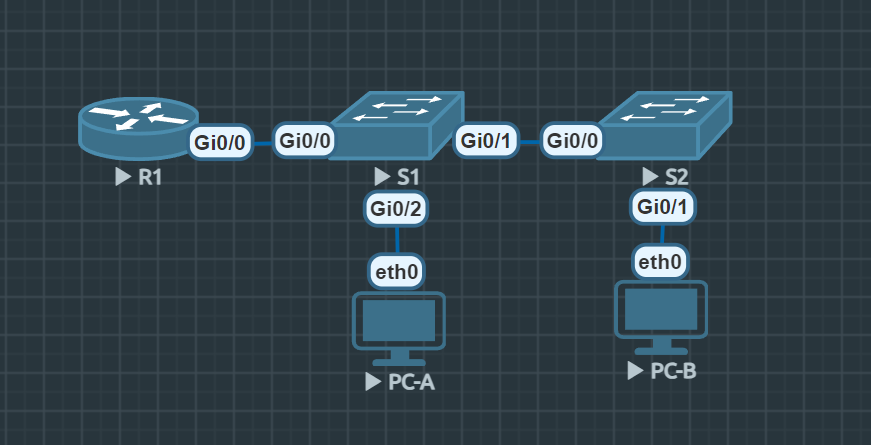

# Лабораторная работа. Внедрение маршрутизации между виртуальными локальными сетями

## Топология


## Таблица адресации

| Устройство | Интерфейс | IP-адрес | Маска подсети | Шлюз по умолчанию |
|---|---|---|---|---|
| R1 | Gi0/0.10 | 192.168.10.1 | 255.255.255.0 | — |
| R1 | Gi0/0.20 | 192.168.20.1 | 255.255.255.0 | — |
| R1 | Gi0/0.30 | 192.168.30.1 | 255.255.255.0 | — |
| R1 | Gi0/0.1000 | — | — | — |
| S1 | VLAN 10 | 192.168.10.11 | 255.255.255.0 | 192.168.10.1 |
| S2 | VLAN 10 | 192.168.10.12 | 255.255.255.0 | 192.168.10.1 |
| PC-A | NIC | 192.168.20.3 | 255.255.255.0 | 192.168.20.1 |
| PC-B | NIC | 192.168.30.3 | 255.255.255.0 | 192.168.30.1 |

## Таблица VLAN

| VLAN | Имя | Назначенный интерфейс |
|---|---|---|
| 10 | Управление | S1: VLAN 10 <br> S2: VLAN 10 |
| 20 | Sales | S1: Gi0/2 |
| 30 | Operations | S2: Gi0/1 |
| 999 | Parking_Lot | С1: Gi0/3, Gi1/0 - 1 <br> С2: Gi0/2 - 3, Gi1/0 - 1 |
| 1000 | Собственная | — |

## Задачи:
* Часть 1. [Создание сети и настройка основных параметров устройства](#создание-сети-и-настройка-основных-параметров-устройства)
* Часть 2. [Создание сетей VLAN и назначение портов коммутатора](#создание-сетей-vlan-и-назначение-портов-коммутатора)
* Часть 3. [Настройка транка 802.1Q между коммутаторами](#настройка-транка-8021q-между-коммутаторами)
* Часть 4. [Настройка маршрутизации между сетями VLAN](#настройка-маршрутизации-между-сетями-vlan)
* Часть 5. [Проверка, что маршрутизация между VLAN работает](#проверка-что-маршрутизация-между-vlan-работает)

## Создание сети и настройка основных параметров устройства

### Настройте базовые параметры для маршрутизатора

``` bash
enable
configure terminal
hostname R1
no ip domain-lookup
enable secret class
line console 0
password cisco
login
logging synchronous
exit
line vty 0 4
password cisco
login
logging synchronous
exit
service password-encryption
banner motd #Authorized access only!#
do copy run start
exit
clock set 21:51:00 6 Oct 2026
```

### Настройте базовые параметры каждого коммутатора.

```bash
enable
configure terminal
hostname S1
no ip domain-lookup
enable secret class
line console 0
password cisco
login
logging synchronous
exit
line vty 0 4
password cisco
login
logging synchronous
exit
service password-encryption
banner motd #Authorized access only!#
do clock set 22:02:00 6 Oct 2026
do copy run start
```

### Настройте узлы ПК.

```bash
#PC-A
VPCS> ip 192.168.20.3/24 192.168.20.1
#PC-B
VPCS> ip 192.168.30.3/24 192.168.30.1
```

## Создание сетей VLAN и назначение портов коммутатора

### Создайте сети VLAN на коммутаторах

```bash
=== S1 ===
enable
configure terminal
vlan 10
 name Management
exit
vlan 20
 name Sales
exit
vlan 999
 name Parking_Lot
exit
interface vlan 10
 ip address 192.168.10.11 255.255.255.0
 no sh
exit
ip default-gateway 192.168.10.1
interface range Gi0/3, Gi1/0 - 1
 switchport mode access
 switchport access vlan 999
 sh
exit
```

```bash
=== S2 ===
enable
configure terminal
vlan 10
 name Management
exit
vlan 30
 name Operations
exit
vlan 999
 name Parking_Lot
exit
interface vlan 10
 ip address 192.168.10.12 255.255.255.0
 no sh
exit
ip default-gateway 192.168.10.1
interface range Gi0/2 - 3, Gi1/0 - 1
 switchport mode access
 switchport access vlan 999
 sh
exit
```

### Назначьте сети VLAN соответствующим интерфейсам коммутатора.

```bash
=== S1 ===
interface Gi0/2
 switchport mode access
 switchport access vlan 20
 no sh
exit
interface Gi0/0
 switchport mode access
 switchport access vlan 10
 no sh
exit
```

```bash
=== S2 ===
interface Gi0/1
 switchport mode access
 switchport access vlan 30
 no sh
exit
interface Gi0/0
 switchport mode access
 switchport access vlan 10
 no sh
exit
```

## Настройка транка 802.1Q между коммутаторами

Был сделан на обоих коммутаторах VLAN Natine 1000.

```bash
=== S1 ===
int Gi0/1
 switchport trunk encapsulation dot1q
 switchport mode trunk
 switchport trunk native vlan 1000
 switchport trunk allowed vlan 10,20,30,1000
 no sh
```

```bash
=== S2 ===
int Gi0/0
 switchport trunk encapsulation dot1q
 switchport mode trunk
 switchport trunk native vlan 1000
 switchport trunk allowed vlan 10,20,30,1000
 no sh
```

- Что произойдет, если Gi0/0 на R1 будет отключен?
*Маршрутизация меж-vlan сломается, так как этим занимается роутер и если порт отключится - связь пропадет. Останется связь между двумя свитчами и внутри vlan-ов*

## Настройка маршрутизации между сетями VLAN

```bash
enable
conf t
int Gi0/0
 no sh
exit

# Делаем субинтерфейсы

int Gi0/0.10
 encapsulation dot1q 10
 ip address 192.168.10.1 255.255.255.0
 description Gateway for VLAN 10 Management
exit
int Gi0/0.20
 encapsulation dot1q 20
 ip address 192.168.20.1 255.255.255.0
 description Gateway for VLAN 20 Sales
exit
int Gi0/0.30
 encapsulation dot1q 30
 ip address 192.168.30.1 255.255.255.0
 description Gateway for VLAN 30 Operations
exit
```

## Проверка, что маршрутизация между VLAN работает

```bash
# Отправьте эхо-запрос с PC-A на шлюз по умолчанию.

VPCS> ping 192.168.20.1
host (192.168.20.1) not reachable

# Ранее я не учла, что для маршрутизации до роутера порт должен быть настроен под режим trunk. Назначила его в vlan управления.

int Gi0/0
 no switchport access vlan 10

 switchport trunk encapsulation dot1q
 switchport mode trunk
 switchport trunk native vlan 1000
 switchport trunk allowed vlan 10,20,30,1000
 no sh

VPCS> ping 192.168.20.1

84 bytes from 192.168.20.1 icmp_seq=1 ttl=255 time=8.702 ms
84 bytes from 192.168.20.1 icmp_seq=2 ttl=255 time=7.066 ms
84 bytes from 192.168.20.1 icmp_seq=3 ttl=255 time=6.878 ms
84 bytes from 192.168.20.1 icmp_seq=4 ttl=255 time=8.424 ms
84 bytes from 192.168.20.1 icmp_seq=5 ttl=255 time=8.327 ms

# Отправьте эхо-запрос с PC-A на PC-B.
VPCS> ping 192.168.30.3

192.168.30.3 icmp_seq=1 timeout
192.168.30.3 icmp_seq=2 timeout
192.168.30.3 icmp_seq=3 timeout
192.168.30.3 icmp_seq=4 timeout
192.168.30.3 icmp_seq=5 timeout

# В процессе траблшутинга дошло, что S1, так же должен знать про vlan 30, иначе пакеты будут дропаться. Добавила vlan 30 на S1 и vlan 20 на S2 соответственно.

VPCS> ping 192.168.30.3

84 bytes from 192.168.30.3 icmp_seq=1 ttl=63 time=35.700 ms
84 bytes from 192.168.30.3 icmp_seq=2 ttl=63 time=12.187 ms
84 bytes from 192.168.30.3 icmp_seq=3 ttl=63 time=17.788 ms
84 bytes from 192.168.30.3 icmp_seq=4 ttl=63 time=15.727 ms
^C

# Отправьте команду ping с компьютера PC-A на коммутатор S2

VPCS> ping 192.168.10.12

192.168.10.12 icmp_seq=1 timeout
192.168.10.12 icmp_seq=2 timeout
192.168.10.12 icmp_seq=3 timeout
192.168.10.12 icmp_seq=4 timeout
^C

# 40 минут мучений) Проблема решается, отключением ip маршрутизации (no ip routing) на обоих коммутаторах, почему-то она была включена по-умолчанию.

VPCS> ping 192.168.10.12

192.168.10.12 icmp_seq=1 timeout
84 bytes from 192.168.10.12 icmp_seq=2 ttl=254 time=14.670 ms
84 bytes from 192.168.10.12 icmp_seq=3 ttl=254 time=11.652 ms
84 bytes from 192.168.10.12 icmp_seq=4 ttl=254 time=13.759 ms
84 bytes from 192.168.10.12 icmp_seq=5 ttl=254 time=15.444 ms

# Пройдите следующий тест с PC-B (Какие промежуточные IP-адреса отображаются в результатах?)

VPCS> trace 192.168.20.3
trace to 192.168.20.3, 8 hops max, press Ctrl+C to stop
 1   192.168.30.1   18.211 ms  12.744 ms  11.070 ms
 2   *192.168.20.3   17.908 ms (ICMP type:3, code:3, Destination port unreachable)

# Промежуточным узлом является субинтерфейс нашего роутера, так как маршрут идет за пределы сети PC-B и это его шлюз по-умолчанию.
```